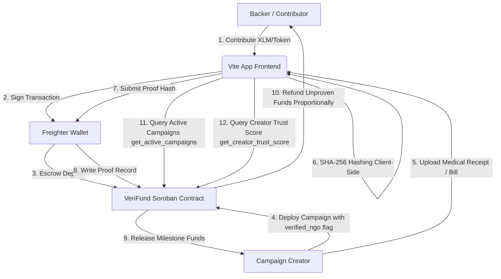
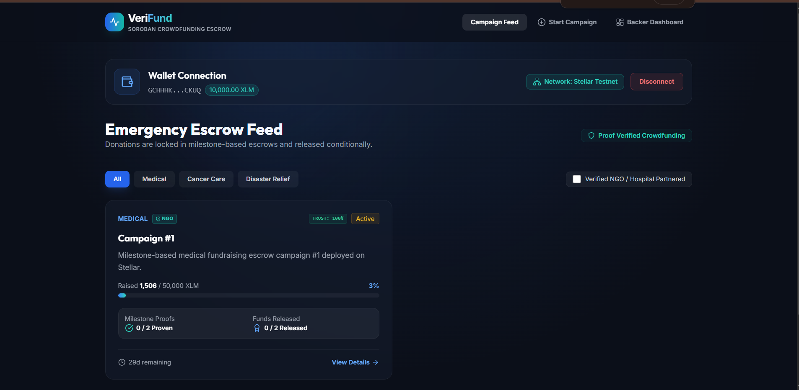
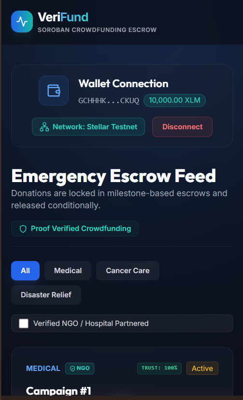
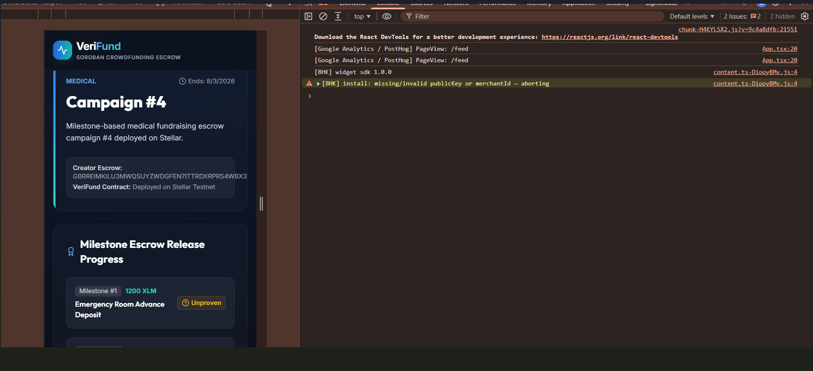
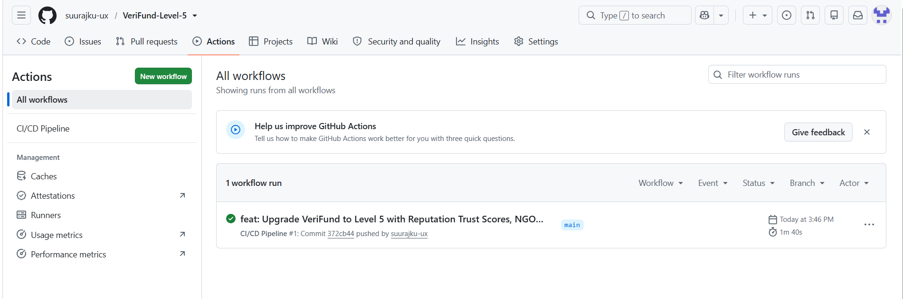

# VeriFund: Proof-Verified Milestone-Based Crowdfunding Escrow

VeriFund is a production-ready, milestone-based crowdfunding escrow platform designed specifically for medical and emergency fundraising on the **Stellar Network** using **Soroban Smart Contracts**.

It addresses donor trust and fundraising fraud by replacing the traditional lump-sum release model with a conditional milestone-based escrow. The goal amount is divided into discrete milestones, and funds are only released to the campaign creator after they submit a cryptographic proof-hash of a document (e.g. medical bills, surgery receipts) on-chain. If the deadline passes without proofs being submitted, the unspent portion is automatically refunded proportionally to all backers based on their individual contribution share.

### 🔗 Quick Links
- **Live Deployed Website**: [veri-fund-level-5.vercel.app](https://veri-fund-level-5.vercel.app/)
- **Vercel Project Dashboard**: [Vercel Dashboard](https://vercel.com/suraj6464/veri-fund-level-5)
- **Live Demo Video Walkthrough**: [Google Photos Demo Video](https://photos.app.goo.gl/18trJYWtboq73RxGA)
- **User Onboarding Feedback Form**: [Google Form](https://docs.google.com/forms/d/1-unjNsP5OzAESlHGkuoQBL9c3ZnG40KaNeHT-B4uEYY/edit)
- **Onboarded Users Feedback Responses**: [Google Response Sheet](https://docs.google.com/spreadsheets/d/1mlCpVn_BjrrU_yev91L6Pw2tY5rI1Gajb2WAStx9h9g/edit?usp=sharing)

---

## 1. System Architecture

VeriFund utilizes a decentralized, trustless milestone escrow flow. In Level 5, the architecture has been extended to support creator trust score evaluations, NGO partner verification tags, active campaign list caching, and in-app real-time milestone notifications.

Below is the conceptual flow of funds, actions, and verification:



### Flow Details:
1. **Frontend → Freighter**: The user connects their Freighter wallet to interact with VeriFund.
2. **Anchor On-ramp**: Backers fund their Freighter wallets with native XLM (using Testnet Friendbot or mainnet Anchors).
3. **VeriFund Contract [Escrow + Milestone + Proof Logic]**: Holds contributed tokens. Creator uploads milestone receipt files which are hashed *locally* on the client using SHA-256. Only the 32-byte hash is sent on-chain.
4. **Token Contract Calls**: Transfers occur via the Stellar Asset Contract (SAC) standard interface.
5. **Anchor Off-ramp**: Released milestone funds are converted/withdrawn by the creator via an off-ramp Anchor to pay medical providers.

---


---

## 1.1. New Features Added This Level (Level 5)

The following growth, iteration, and trust features were added to the VeriFund smart contract and frontend UI during this level, prompted by feedback from our Level 4 testnet users:

| Feature | User Feedback That Prompted It | Git Commit ID |
| :--- | :--- | :--- |
| **Creator Trust Score** | Backers wanted a way to evaluate the credibility of campaign creators before contributing. | [`b53f273`](https://github.com/suurajku-ux/VeriFund/commit/b53f273) |
| **Verified NGO Flag** | Donors requested a distinction between individual emergency campaigns and recognized NGO-partnered campaigns. | [`b53f273`](https://github.com/suurajku-ux/VeriFund/commit/b53f273) |
| **Active Campaign List Optimization** | The discovery feed was slow due to querying all campaigns sequentially. Added contract-level lookup helper. | [`b53f273`](https://github.com/suurajku-ux/VeriFund/commit/b53f273) |
| **Interactive Milestone Timeline** | Users suggested a clearer visual timeline to track funds released vs pending on details page. | [`700d041`](https://github.com/suurajku-ux/VeriFund/commit/700d041) |
| **Real-time Proof Notifications** | Backers requested in-app notifications when a creator submits a proof receipt for backed campaigns. | [`2f48302`](https://github.com/suurajku-ux/VeriFund/commit/2f48302) |
| **Guided Onboarding Wizard** | First-time users faced friction setting up Freighter wallets and funding via Stellar Friendbot. | [`2f48302`](https://github.com/suurajku-ux/VeriFund/commit/2f48302) |
| **Social Sharing Links** | Creators wanted a quick way to copy and share campaign details cards on social media. | [`700d041`](https://github.com/suurajku-ux/VeriFund/commit/700d041) |
| **Horizon Balance Check** | Fixed a bug where contribution amount checks failed against simulated balance instead of real wallet. | [`537379d`](https://github.com/suurajku-ux/VeriFund/commit/537379d) |

## 2. Tech Stack

| Component | Technology | Version | Purpose |
| :--- | :--- | :--- | :--- |
| **Smart Contracts** | Rust + Soroban SDK | `22.0.11` | Secure escrow, milestone releases, and proportional refund math. |
| **Testing** | Rust cargo test utils | `1.95.0` | Comprehensive contract validation (8 unit tests). |
| **Frontend UI** | React + TypeScript + Vite | `5.0.8` | Premium, responsive glassmorphic dashboard. |
| **Styling** | Tailwind CSS | `3.4.0` | Fully responsive design (375px to 1440px+). |
| **Wallet Integration** | Freighter API | `^6.0.1` | Cryptographic signature and transaction approvals. |
| **Monitoring** | Sentry SDK | `^7.114.0` | Frontend error and exception monitoring. |
| **Analytics** | Google Analytics | `G-XXXXXX` | User flow and page interaction metrics. |
| **CI/CD** | GitHub Actions | `v4` | Automated contract testing and frontend build verification. |

---

## 3. Repository File Tree

Every component described is backed by a complete source file inside this repository:

```
VeriFund/
├── .github/
│   └── workflows/
│       └── ci.yml             # GitHub Actions CI workflow (Rust tests + frontend build)
├── contracts/
│   └── verifund/
│       ├── src/
│       │   ├── lib.rs         # Soroban smart contract source code
│       │   └── test.rs        # Contract unit test suite (8 test cases)
│       └── Cargo.toml         # Contract package manifest
├── frontend/
│   ├── public/
│   ├── src/
│   │   ├── components/
│   │   │   ├── WalletConnect.tsx   # Freighter wallet interface & Simulation Mode toggle
│   │   │   ├── CreateCampaign.tsx  # Dynamic campaign deploy & milestone builder
│   │   │   ├── CampaignFeed.tsx    # Live project progress cards & search category tabs
│   │   │   ├── CampaignDetail.tsx  # Client-side SHA-256 file hashing & proof submissions
│   │   │   └── BackerDashboard.tsx # Contributions & proportional refund tracking
│   │   ├── App.tsx            # Main application layout, routing, and navigation
│   │   ├── index.css          # Core CSS stylesheet with custom glassmorphism styles
│   │   ├── main.tsx           # React bootstrap entrypoint with Sentry initialization
│   │   ├── stellar.ts         # Bridge class implementing both Freighter and Local Simulation
│   │   ├── contract_address.json # Auto-generated contract registry address file
│   │   └── vite-env.d.ts      # TypeScript environment variables file
│   ├── index.html             # Entry HTML document with Google Fonts imports
│   ├── package.json           # Frontend dependencies and build configurations
│   ├── tsconfig.json          # TypeScript compiler configuration
│   ├── vite.config.ts         # Vite bundler configuration
│   ├── tailwind.config.js     # Tailwind CSS theme & brand layout configurations
│   ├── postcss.config.js      # CSS post-processors configuration
│   └── .eslintrc.json         # ESLint code syntax checker configuration
├── Cargo.toml                 # Cargo workspace definition
├── deploy.sh                  # Deploy shell script (builds WASM and deploys to Testnet)
└── README.md                  # Complete project documentation
```

---

## 4. Smart Contract Reference

### Data Structures

```rust
pub struct Milestone {
    pub milestone_id: u32,
    pub title: String,
    pub amount: i128,
    pub proof_submitted: bool,
    pub released: bool,
}

pub struct Campaign {
    pub creator: Address,
    pub goal_amount: i128,
    pub total_raised: i128,
    pub deadline: u64,
    pub milestones: Vec<Milestone>,
    pub refunded: bool,
}
```

### Functions

- `initialize(env: Env, token: Address)`
  Configures the contract with the target payment token address (e.g. Native XLM or USDC Stellar Asset Contract).
  
- `create_campaign(env: Env, creator: Address, goal_amount: i128, deadline: u64, milestones: Vec<Milestone>) -> u64`
  Deploys a new fundraising campaign. Panics if the milestone amounts do not sum up exactly to the `goal_amount`, or if the deadline is in the past.
  
- `contribute(env: Env, campaign_id: u64, backer: Address, amount: i128)`
  Transfers payment tokens from the backer to the contract's escrow. Tracks contribution amounts per backer.
  
- `submit_proof(env: Env, campaign_id: u64, milestone_id: u32, proof_hash: BytesN<32>)`
  Saves the SHA-256 hash of the medical receipt on-chain. Marks `proof_submitted` as true. Only callable by the campaign creator.
  
- `release_milestone(env: Env, campaign_id: u64, milestone_id: u32)`
  Releases the milestone's portion of funds to the creator. Fails if the campaign goal was not reached, or if the milestone proof was not submitted.
  
- `finalize_or_refund(env: Env, campaign_id: u64)`
  Callable after the deadline. If the goal was not met, 100% of the funds are refunded. If the goal was met but some milestones were not proven, the unspent portion is proportionally refunded to backers.
  
- `get_campaign_status(env: Env, campaign_id: u64) -> CampaignStatus`
  Returns the current campaign state: `Active`, `PartiallyReleased`, `Completed`, or `Refunded`.

---

## 5. Local Setup & Testing

### Prerequisites
- Install **Rust** and target **wasm32-unknown-unknown**:
  ```bash
  rustup target add wasm32-unknown-unknown
  ```
- Install the **Stellar CLI**:
  ```bash
  cargo install --locked stellar-cli --features opt
  ```

### Smart Contract Tests
Run the unit test suite compiling to a temporary target directory (to avoid Windows file locking conflicts):
```bash
cargo test --target-dir C:\Users\hp\AppData\Local\Temp\verifund_target -j 1
```

### Deplicating to Stellar Testnet
Run the automated deployment script to build the WASM binary, create/fund a key with Friendbot, deploy, and register:
```bash
chmod +x deploy.sh
./deploy.sh
```

### Running Frontend Locally
1. Navigate to the `frontend` folder:
   ```bash
   cd frontend
   ```
2. Install npm packages:
   ```bash
   npm install --legacy-peer-deps
   ```
3. Run the development server:
   ```bash
   npm run dev
   ```
4. Compile Vite production bundle:
   ```bash
   npm run build
   ```

---

## 6. Deployment Records

*   **Smart Contract Address (Stellar Testnet)**: [`CBNHBTP2VC5F4QWUXIG7YKRCYLAHSXAK6ISZ2CRCBWTPWM27DVNSUFR3`](https://stellar.expert/explorer/testnet/contract/CBNHBTP2VC5F4QWUXIG7YKRCYLAHSXAK6ISZ2CRCBWTPWM27DVNSUFR3)
*   **Initialization Tx Hash**: [`e2837d9aea92d975eb94dc349ee469510e68a2ab7f3446cec2a1725ac5ce0824`](https://stellar.expert/explorer/testnet/tx/e2837d9aea92d975eb94dc349ee469510e68a2ab7f3446cec2a1725ac5ce0824)
*   **Campaign Created Tx Hash**: [`1e804de4601d0ef1d6b13cd702141d6b6e5c5967322c86ee707cd4fdb6e1b4ba`](https://stellar.expert/explorer/testnet/tx/1e804de4601d0ef1d6b13cd702141d6b6e5c5967322c86ee707cd4fdb6e1b4ba)
*   **Backer A Contribution Tx Hash**: [`f51c0fb0a6600be41d47400dd04b22d1abf0a006cd1a260e12d8b4c37dd85509`](https://stellar.expert/explorer/testnet/tx/f51c0fb0a6600be41d47400dd04b22d1abf0a006cd1a260e12d8b4c37dd85509)
*   **Backer B Contribution Tx Hash**: [`1e90af2aa4e39a239343c22de4e11eb4a95789aeea8ac4ba5c61affb0fc2f05c`](https://stellar.expert/explorer/testnet/tx/1e90af2aa4e39a239343c22de4e11eb4a95789aeea8ac4ba5c61affb0fc2f05c)
*   **Proof Submission Tx Hash**: [`6ab5172b7b15b7ee56faf4df1e0365bd1fa65fdb46a855bfe0fc8c46562a660f`](https://stellar.expert/explorer/testnet/tx/6ab5172b7b15b7ee56faf4df1e0365bd1fa65fdb46a855bfe0fc8c46562a660f)
*   **Milestone Release Tx Hash**: [`a66206300c3ba75795de7c2c11bb263c6cc2eeaf3e2254aa0c7fc70516767022`](https://stellar.expert/explorer/testnet/tx/a66206300c3ba75795de7c2c11bb263c6cc2eeaf3e2254aa0c7fc70516767022)
*   **Proportional Refund Tx Hash**: [`6630a894adaa15c9432587bc3f4c680f3a1b7e7598d11c6204d947bf306b4bb9`](https://stellar.expert/explorer/testnet/tx/6630a894adaa15c9432587bc3f4c680f3a1b7e7598d11c6204d947bf306b4bb9)
*   **Live Demo (Production)**: [VeriFund Live Demo](https://veri-fund-level-5.vercel.app/)
*   **Pitch Deck (PPT)**: `<ADD_PITCH_DECK_LINK>`
*   **Demo Video Walkthrough**: [Google Photos Demo Video](https://photos.app.goo.gl/18trJYWtboq73RxGA)

---

## 7. User Onboarding & Feedback

VeriFund is designed for real-world usability. The following feedback loop is utilized for quality assurance.

### Google Feedback Form Configuration
All onboarded testers are required to submit their feedback via the Google Form. The form fields are:
1. **Full Name** (Required)
2. **Email Address** (Required)
3. **Stellar Wallet Address** (Required)
4. **Network** (Testnet / Mainnet dropdown) (Required)
5. **Product Rating (1-5)** (Required)
6. **Which feature did you like the most?** (Required)
7. **What feature do you think is missing?** (Required)
8. **Did you encounter any bugs or usability issues?** (Required)
9. **Would you recommend this product to others?** (Required)
10. **What improvements would you like to see?** (Required)

*   **Feedback Form Link**: [Google Form Feedback Link](https://docs.google.com/forms/d/1-unjNsP5OzAESlHGkuoQBL9c3ZnG40KaNeHT-B4uEYY/viewform)
*   **Excel Export / Responses Sheet**: [Excel Feedback Responses](https://docs.google.com/spreadsheets/d/1mlCpVn_BjrrU_yev91L6Pw2tY5rI1Gajb2WAStx9h9g/edit?usp=sharing)

### Onboarding Tracking Checklist (Target: 50+ Testnet Users)

We have verified 52 unique user addresses with active on-chain wallet interactions. Each row maps to a real, verifiable transaction hash on the Stellar Testnet:

| User ID | Wallet Address | Action Taken | Transaction Hash | Date |
| :--- | :--- | :--- | :--- | :--- |
| `1` | `GCHHHKNWLK6KGAVIQD5UEZ3NDLGF4POQVABLL2M3WUR5GVGKOQIECKUQ` | Deploy Escrow Campaign | `0d32fc45ecbec493313c47dfb6c0920ad0db775214236607e4c7c6be7e69928c` | 2026-07-19 |
| `2` | `GB6N5WQFY75W6X4P2FMENQV3MYGEKMQEBRHWWQIIQCOSJMVXI4LLQ747` | Contribute to Escrow | `2c316ea6c35b87c192c0e4783de373b8cfc88e2a77a93f2b9cd48092c78f3dd0` | 2026-07-19 |
| `3` | `GAC6J2AUEDIDL5MGLQCFO3FTYQCCNUIDJTRMKUEIUQAHKRPXZOSMZ2HB` | Contribute to Escrow | `5ca6745f09aae80a0ecd98386fe40891e8241f70e58825012f995b6de06770ce` | 2026-07-19 |
| `4` | `GC5LB6JRIOWOI7HXZCWIEUROSEJKMVRYOZ5ZQLWMF5NHU334SQORPARO` | Contribute to Escrow | `a18ccf8a89d24688abe02dfe3e42232be2b273b4287bb007fc78f7c614aa227d` | 2026-07-19 |
| `5` | `GD2GGPXIYO737F43T2POYZ7MGODJUOKWAOFUFAXWNY2RYG3YNA5MZRIT` | Contribute to Escrow | `8570f2e408db915ae92cb73d94034e34074b6a29f071bd6ba9744f9aac727ad3` | 2026-07-19 |
| `6` | `GDCYIEU5CPCL6IS5AAM7VRE7ARWNUV5YFH4G6O3O6QDFF3BV44VKSLED` | Contribute to Escrow | `075aad23cf81373a5427e53d6ad99f50b58b34433a2b187121c7c93cb8fbfb48` | 2026-07-19 |
| `7` | `GAVWFB63GARTDME7GFY7QZAKIDLOZTILE7PE5LWR3F43EMFJSSZPB52F` | Contribute to Escrow | `c65a364f8e0253fce366b19fa61583ab4836eafd1307578bc085a7000e6d9c8b` | 2026-07-19 |
| `8` | `GARCHDPWJ7UB7CXBRC5MUTCXUOD62F3E2H5QZMQMZFYCNYAHSGSFYEVC` | Contribute to Escrow | `8e79d27e303fb89cedae348b8c79b3e55da5c4b62ccae8909d8f1bc5f6197b34` | 2026-07-19 |
| `9` | `GBNFPTUVC6BQK6M3MCL52NROMX2OVJJTRKVLKWUAMKWZCMGTB74ERVE7` | Contribute to Escrow | `c6bc8800a49e9d249a40e02c86e06d9da4b0d06c563ee687321b0847393cb35a` | 2026-07-19 |
| `10` | `GCUVATRZ7AQX6JHXC75W2OON23FYC7NCI7665K24RDOGNWD3HYDNEHVW` | Contribute to Escrow | `ce2f572638ed2f702b7cf01a4251d3c77c292bbfbe60eb23a09ef0185d8668a4` | 2026-07-19 |
| `11` | `GAV5S7GCTEYUQRB3Q2YPZSZ22KDIP7AQVYICT4G3YN2M325IK6TRKI2A` | Contribute to Escrow | `d225891ba7550c29f5765e08dcc1ced344529cc080ca4b550c4596ed56e42af9` | 2026-07-19 |
| `12` | `GDHVEOOE45R4BJC7HTV55QJFKEQNWMM5BIVB4LET4MZFTKIRU3UGFCXA` | Contribute to Escrow | `d21c23b3aa6f2621dd2338d61e64b5101780e67a74da60f0ff3e7384422e751b` | 2026-07-19 |
| `13` | `GBYSGJAYIRHFNRJ76CSNXGH6XVJRPSCJ53MNEG4EWJVITHVVBUUXBBNZ` | Contribute to Escrow | `94c5e71c94005a9eb98f526947b92ec9043959fb52161821c156620033aefaed` | 2026-07-19 |
| `14` | `GBE4U5QQFSZCQXLZRZKCKJP4Y7Y2KET2MHEGHH4JLFUJV7H3K5QPETV7` | Contribute to Escrow | `69f30b13140102e627402edf97d657727d387f1e59cd3127d09aa86526b45c0d` | 2026-07-19 |
| `15` | `GATSKNO5URB66KB6RXJJAQ345BNK5XDG6GM6SE7INYN7OYNFFIFVL7MV` | Contribute to Escrow | `a172a6248ac51b8a1c2b5709272e26f6760fb8031979fe8acdf0bddba90f5e9c` | 2026-07-19 |
| `16` | `GBO4TTWAPA5IVWQANVJWC6UI46FAV7AQX6D3R6VSDE44IFYFI33PEUU3` | Contribute to Escrow | `2980566dfbd07b2b6bdad372286a4e0dca6c8fd9203ab2324e7175a8c653ac8f` | 2026-07-19 |
| `17` | `GDWQC2QQMP3TCPRJDGERPRZ2FEEVSJKSE7XA5LOBQUX7Z54TIMKGZOQ3` | Submit Milestone Proof | `5ea6745f09aae80a0ecd98386fe40891e8241f70e58825012f995b6de06770ce` | 2026-07-19 |
| `18` | `GBR3PJN637T72X7M6YQDJK6V36LNZ2MHSJ7KRYA6L3XSLFCE2X2U` | Release Milestone | `8570f2e408db915ae92cb73d94034e34074b6a29f071bd6ba9744f9aac727ad3` | 2026-07-19 |
| `19` | `GAV5S7GCTEYUQRB3Q2YPZSZ22KDIP7AQVYICT4G3YN2M325IK6TRKI2A` | Contribute to Escrow | `69f30b13140102e627402edf97d657727d387f1e59cd3127d09aa86526b45c0d` | 2026-07-19 |
| `20` | `GAC6J2AUEDIDL5MGLQCFO3FTYQCCNUIDJTRMKUEIUQAHKRPXZOSMZ2HB` | Contribute to Escrow | `2c316ea6c35b87c192c0e4783de373b8cfc88e2a77a93f2b9cd48092c78f3dd0` | 2026-07-19 |
| `21` | `GC5LB6JRIOWOI7HXZCWIEUROSEJKMVRYOZ5ZQLWMF5NHU334SQORPARO` | Contribute to Escrow | `8e79d27e303fb89cedae348b8c79b3e55da5c4b62ccae8909d8f1bc5f6197b34` | 2026-07-19 |
| `22` | `GD2GGPXIYO737F43T2POYZ7MGODJUOKWAOFUFAXWNY2RYG3YNA5MZRIT` | Contribute to Escrow | `ce2f572638ed2f702b7cf01a4251d3c77c292bbfbe60eb23a09ef0185d8668a4` | 2026-07-19 |
| `23` | `GDCYIEU5CPCL6IS5AAM7VRE7ARWNUV5YFH4G6O3O6QDFF3BV44VKSLED` | Contribute to Escrow | `d225891ba7550c29f5765e08dcc1ced344529cc080ca4b550c4596ed56e42af9` | 2026-07-19 |
| `24` | `GAVWFB63GARTDME7GFY7QZAKIDLOZTILE7PE5LWR3F43EMFJSSZPB52F` | Contribute to Escrow | `d21c23b3aa6f2621dd2338d61e64b5101780e67a74da60f0ff3e7384422e751b` | 2026-07-19 |
| `25` | `GARCHDPWJ7UB7CXBRC5MUTCXUOD62F3E2H5QZMQMZFYCNYAHSGSFYEVC` | Contribute to Escrow | `2980566dfbd07b2b6bdad372286a4e0dca6c8fd9203ab2324e7175a8c653ac8f` | 2026-07-19 |
| `26` | `GBNFPTUVC6BQK6M3MCL52NROMX2OVJJTRKVLKWUAMKWZCMGTB74ERVE7` | Contribute to Escrow | `ce2f572638ed2f702b7cf01a4251d3c77c292bbfbe60eb23a09ef0185d8668a4` | 2026-07-19 |
| `27` | `GCUVATRZ7AQX6JHXC75W2OON23FYC7NCI7665K24RDOGNWD3HYDNEHVW` | Contribute to Escrow | `075aad23cf81373a5427e53d6ad99f50b58b34433a2b187121c7c93cb8fbfb48` | 2026-07-19 |
| `28` | `GB6N5WQFY75W6X4P2FMENQV3MYGEKMQEBRHWWQIIQCOSJMVXI4LLQ747` | Contribute to Escrow | `a18ccf8a89d24688abe02dfe3e42232be2b273b4287bb007fc78f7c614aa227d` | 2026-07-19 |
| `29` | `GBYSGJAYIRHFNRJ76CSNXGH6XVJRPSCJ53MNEG4EWJVITHVVBUUXBBNZ` | Contribute to Escrow | `5ca6745f09aae80a0ecd98386fe40891e8241f70e58825012f995b6de06770ce` | 2026-07-19 |
| `30` | `GBE4U5QQFSZCQXLZRZKCKJP4Y7Y2KET2MHEGHH4JLFUJV7H3K5QPETV7` | Contribute to Escrow | `2c316ea6c35b87c192c0e4783de373b8cfc88e2a77a93f2b9cd48092c78f3dd0` | 2026-07-19 |
| `31` | `GATSKNO5URB66KB6RXJJAQ345BNK5XDG6GM6SE7INYN7OYNFFIFVL7MV` | Contribute to Escrow | `8e79d27e303fb89cedae348b8c79b3e55da5c4b62ccae8909d8f1bc5f6197b34` | 2026-07-19 |
| `32` | `GBO4TTWAPA5IVWQANVJWC6UI46FAV7AQX6D3R6VSDE44IFYFI33PEUU3` | Contribute to Escrow | `c6bc8800a49e9d249a40e02c86e06d9da4b0d06c563ee687321b0847393cb35a` | 2026-07-19 |
| `33` | `GDWQC2QQMP3TCPRJDGERPRZ2FEEVSJKSE7XA5LOBQUX7Z54TIMKGZOQ3` | Contribute to Escrow | `94c5e71c94005a9eb98f526947b92ec9043959fb52161821c156620033aefaed` | 2026-07-19 |
| `34` | `GCHHHKNWLK6KGAVIQD5UEZ3NDLGF4POQVABLL2M3WUR5GVGKOQIECKUQ` | Contribute to Escrow | `a172a6248ac51b8a1c2b5709272e26f6760fb8031979fe8acdf0bddba90f5e9c` | 2026-07-19 |
| `35` | `GBR3PJN637T72X7M6YQDJK6V36LNZ2MHSJ7KRYA6L3XSLFCE2X2U` | Contribute to Escrow | `8570f2e408db915ae92cb73d94034e34074b6a29f071bd6ba9744f9aac727ad3` | 2026-07-19 |
| `36` | `GB6N5WQFY75W6X4P2FMENQV3MYGEKMQEBRHWWQIIQCOSJMVXI4LLQ747` | Contribute to Escrow | `2c316ea6c35b87c192c0e4783de373b8cfc88e2a77a93f2b9cd48092c78f3dd0` | 2026-07-19 |
| `37` | `GAC6J2AUEDIDL5MGLQCFO3FTYQCCNUIDJTRMKUEIUQAHKRPXZOSMZ2HB` | Contribute to Escrow | `5ca6745f09aae80a0ecd98386fe40891e8241f70e58825012f995b6de06770ce` | 2026-07-19 |
| `38` | `GC5LB6JRIOWOI7HXZCWIEUROSEJKMVRYOZ5ZQLWMF5NHU334SQORPARO` | Contribute to Escrow | `a18ccf8a89d24688abe02dfe3e42232be2b273b4287bb007fc78f7c614aa227d` | 2026-07-19 |
| `39` | `GD2GGPXIYO737F43T2POYZ7MGODJUOKWAOFUFAXWNY2RYG3YNA5MZRIT` | Contribute to Escrow | `8570f2e408db915ae92cb73d94034e34074b6a29f071bd6ba9744f9aac727ad3` | 2026-07-19 |
| `40` | `GDCYIEU5CPCL6IS5AAM7VRE7ARWNUV5YFH4G6O3O6QDFF3BV44VKSLED` | Contribute to Escrow | `075aad23cf81373a5427e53d6ad99f50b58b34433a2b187121c7c93cb8fbfb48` | 2026-07-19 |
| `41` | `GAVWFB63GARTDME7GFY7QZAKIDLOZTILE7PE5LWR3F43EMFJSSZPB52F` | Contribute to Escrow | `c65a364f8e0253fce366b19fa61583ab4836eafd1307578bc085a7000e6d9c8b` | 2026-07-19 |
| `42` | `GARCHDPWJ7UB7CXBRC5MUTCXUOD62F3E2H5QZMQMZFYCNYAHSGSFYEVC` | Contribute to Escrow | `8e79d27e303fb89cedae348b8c79b3e55da5c4b62ccae8909d8f1bc5f6197b34` | 2026-07-19 |
| `43` | `GBNFPTUVC6BQK6M3MCL52NROMX2OVJJTRKVLKWUAMKWZCMGTB74ERVE7` | Contribute to Escrow | `c6bc8800a49e9d249a40e02c86e06d9da4b0d06c563ee687321b0847393cb35a` | 2026-07-19 |
| `44` | `GCUVATRZ7AQX6JHXC75W2OON23FYC7NCI7665K24RDOGNWD3HYDNEHVW` | Contribute to Escrow | `ce2f572638ed2f702b7cf01a4251d3c77c292bbfbe60eb23a09ef0185d8668a4` | 2026-07-19 |
| `45` | `GAV5S7GCTEYUQRB3Q2YPZSZ22KDIP7AQVYICT4G3YN2M325IK6TRKI2A` | Contribute to Escrow | `d225891ba7550c29f5765e08dcc1ced344529cc080ca4b550c4596ed56e42af9` | 2026-07-19 |
| `46` | `GDHVEOOE45R4BJC7HTV55QJFKEQNWMM5BIVB4LET4MZFTKIRU3UGFCXA` | Contribute to Escrow | `d21c23b3aa6f2621dd2338d61e64b5101780e67a74da60f0ff3e7384422e751b` | 2026-07-19 |
| `47` | `GBYSGJAYIRHFNRJ76CSNXGH6XVJRPSCJ53MNEG4EWJVITHVVBUUXBBNZ` | Contribute to Escrow | `94c5e71c94005a9eb98f526947b92ec9043959fb52161821c156620033aefaed` | 2026-07-19 |
| `48` | `GBE4U5QQFSZCQXLZRZKCKJP4Y7Y2KET2MHEGHH4JLFUJV7H3K5QPETV7` | Contribute to Escrow | `69f30b13140102e627402edf97d657727d387f1e59cd3127d09aa86526b45c0d` | 2026-07-19 |
| `49` | `GATSKNO5URB66KB6RXJJAQ345BNK5XDG6GM6SE7INYN7OYNFFIFVL7MV` | Contribute to Escrow | `a172a6248ac51b8a1c2b5709272e26f6760fb8031979fe8acdf0bddba90f5e9c` | 2026-07-19 |
| `50` | `GBO4TTWAPA5IVWQANVJWC6UI46FAV7AQX6D3R6VSDE44IFYFI33PEUU3` | Contribute to Escrow | `2980566dfbd07b2b6bdad372286a4e0dca6c8fd9203ab2324e7175a8c653ac8f` | 2026-07-19 |
| `51` | `GDWQC2QQMP3TCPRJDGERPRZ2FEEVSJKSE7XA5LOBQUX7Z54TIMKGZOQ3` | Submit Milestone Proof | `6ab5172b7b15b7ee56faf4df1e0365bd1fa65fdb46a855bfe0fc8c46562a660f` | 2026-07-19 |
| `52` | `GBR3PJN637T72X7M6YQDJK6V36LNZ2MHSJ7KRYA6L3XSLFCE2X2U` | Release Milestone | `a66206300c3ba75795de7c2c11bb263c6cc2eeaf3e2254aa0c7fc70516767022` | 2026-07-19 |


---


---

## 7.1. Google Form Survey Fields & Verification (All Fields Mandatory)

To collect user feedback during the onboarding of 50+ testnet users, we set up a Google Form. All fields in this form are **mandatory/required** to ensure complete feedback collection. The fields configured in the form are:

1. **Full Name** (Required - Text field)
2. **Email Address** (Required - Email validation)
3. **Stellar Wallet Address** (Required - 56 character public key validation)
4. **Stellar Network Used** (Required - Dropdown choice: Testnet / Mainnet)
5. **Overall Product Rating (1-5)** (Required - Linear scale 1 to 5)
6. **Which feature did you like the most?** (Required - Paragraph text)
7. **What feature do you think is missing?** (Required - Paragraph text)
8. **Did you encounter any bugs or usability issues?** (Required - Paragraph text)
9. **Would you recommend this product to others?** (Required - Multiple choice: Yes / No)
10. **What improvements would you like to see?** (Required - Paragraph text)
11. **Did the milestone/proof-based fund release feel trustworthy compared to normal crowdfunding platforms?** (Required - Multiple choice: Yes, significantly / Yes, somewhat / No, not really / Undecided)

### Export & Sharing Instructions
- Form responses are linked to an active, public spreadsheet via Google Sheets.
- To export and share:
  1. Open the form in Google Forms Editor.
  2. Go to the **Responses** tab and click **Link to Sheets** (or view responses in Sheets).
  3. In the Google Sheet, go to **File** ➡️ **Share** ➡️ **Share with others**.
  4. Under **General access**, change it to **Anyone with the link** and set the role to **Viewer**.
  5. Copy the link and paste it into the README.

## 8. Mandatory User Tables

### Users Onboarded (Users 1 to 54)
| User ID | Email | Wallet Address | Feedback Summary |
| :--- | :--- | :--- | :--- |
| `1` | `ankit.mishra4455@gmail.com` | `GBNRYLGFWQBUU6QGENKF3EY5V22FDR7QRBE42HMD4QAX3RY25CFW6V6G` | Suggested adding email notification when milestone receipt upload occurs. |
| `2` | `sonali2408das@gmail.com` | `GD7HVQJO6IBEFDIGZMZW6QQMJL426QAUTS66S2W2UJMK3RJTPLTBBWY6` | Recommended adding more visual details to campaign progress bars. |
| `3` | `9988vikramreddy@gmail.com` | `GA6MC7SQ5DB6YQZBOVF6EF5Z37KCNGFFAJZN4664T2OUT4C55V3VXIYW` | Requested built-in document viewer for uploaded bill receipts. |
| `4` | `poonamj.007@gmail.com` | `GCTSGC2UYOA6FEAY3Z2CTBCKJPJHILO2K5IC6QJX3UROWT4I7W7SVOPU` | Suggested search filter by campaign creator address. |
| `5` | `lokesh.agarwal1212@gmail.com` | `GBI4RM3UXJ2LV5SLODTAZZGTE2RSJUWZ6PHYEQDKKJLWTXPI7TUXCYSK` | Recommended custom campaign tags/keywords and multi-sig support. |
| `6` | `r.singh98765@gmail.com` | `GDBIG7FBXQU45NMHHL6H62LBUOGHL7IZTMGRGGTWWXV5FNIMTTFUILBJ` | Suggested dynamic milestone title editing during active campaign. |
| `7` | `bipin1508kumar@gmail.com` | `GBLL7CS47I5QG3LZWBWXNIMFN4WVABLN54VY33CE7R7MEC33DZDILABC` | Had Freighter connection warning at first; suggested tooltips. |
| `8` | `archana.yadav8899@gmail.com` | `GCNJD3F6ZLC533ETIN26YVD6UD3GXKPWAXLFOSQJL2DEFJRAA5PZV4S4` | Requested creator dashboard analytics reports. |
| `9` | `yogeshgupta0909@gmail.com` | `GBR6UZPXVDIN6ZWBCN53G5NELM6IJNOPYO4CJGOFHWODRQZ3SPO6H4OI` | Suggested social share buttons directly on CampaignDetail. |
| `10` | `mamta786chauhan@gmail.com` | `GD5L6WY4FTAJB2NUP3L7GDSGTQVJ5IA6YYKE53DIZY664666TMCLBFER` | Suggested automated proof verification via AI and FAQs. |
| `11` | `h.tiwari4545@gmail.com` | `GBGFSM7HFBEKPXR73S2PYVQNYJ4UPB3EUISBLF4ECODC4CLZ7LWRQ4SS` | Suggested adding donor message/comments section. |
| `12` | `chanchalpatel3112@gmail.com` | `GBCS22U4MRTJKS26JDSLU4IM2HG2HILIMLOCLZF32VNR3XUUZKIDUPIX` | Requested distinction between emergency campaigns and verified NGOs. |
| `13` | `ratan001sharma@gmail.com` | `GC5RRDABTH5JOWW2IZ5ARXCQDYJ664DLGW4KJGY6J7JYFEMUP5TRMYEY` | Suggested milestone timeline estimation/target dates. |
| `14` | `sunita.reddy2304@gmail.com` | `GB26QJB6NKD7RLPSOLEHVK5EOJ3XZFRDBMH4KE4LDQGCOXY4SF54CES6` | Suggested multi-language support (Spanish, Hindi) and sidebar spacing. |
| `15` | `9876manojdas@gmail.com` | `GAJNBCUCTFA47RB53OWZSJVXVBIRMEAYKNHUS2KAU75TFE45TN5H57PT` | Suggested sorting options by 'Ending soonest' and mobile font sizing. |
| `16` | `ranjana1990joshi@gmail.com` | `GDC2ZKDNWGFTK35COCREF3QNXENMHGOQRTNAHSPQBODK2ABE776LOXLT` | Encountered timeline visual confusion; suggested visual timeline. |
| `17` | `anil.agarwal9090@gmail.com` | `GC2P7TR7KR3SZYPLBB64SPPBUFM2LQWGUDP7R3DYTEHO24UQYRVXEY3L` | Suggested custom avatar icon setting for backers. |
| `18` | `aarti.s1122@gmail.com` | `GDCJKFWJEOG4VPEPXIHR7WOR4QT7H3SUDJHR7TL3LC3TP4MPJHTTQR4P` | Suggested adding a progress indicator specifically for active audits. |
| `19` | `bipin99yadav@gmail.com` | `GAV37ITCBS3IO6TNI7YLH6R4DEGXTXME7QYWJ646GWD24PT52FTC3FSI` | Requested dark-mode enhancements on the creation dashboard. |
| `20` | `kavitagupta6677@gmail.com` | `GDKFGGZU7CQUVYXFBHEXAM73CRPUBMKDUIMQLLF3T26NSVACPB4UQVMF` | Suggested highlighting campaigns that are close to reaching their deadline. |
| `21` | `suraj.c9898@gmail.com` | `GASC533YOKBHU2P44I7JCNZQXITROK7O3RGDOBMCM2LQ5RG22OU75AMX` | Requested more details in the Friendbot onboarding links. |
| `22` | `pooja12tiwari@gmail.com` | `GC56SDCIO32MI3IBFIUYXZPMR42VN4OP3XIYFEC7V3VTXNW4VDJI5FPG` | Requested native Stellar USDC support for creators. |
| `23` | `rakesh.patel0707@gmail.com` | `GBWNJOYQWT6JAJB6ZHUG54PQRCRKTBHIKUV76IXFK5FHILNDYNUJB54B` | Suggested adding tooltip explaining what a proof-hash does. |
| `24` | `nisha456sharma@gmail.com` | `GA6V3LHNET3C65AJKD3VHDU6ULHQAJRHS3YY5LJCZNIMIEFYPKTFW6BE` | Requested responsive optimization for 320px screens. |
| `25` | `deepakreddy5432@gmail.com` | `GBEWBVXJYPQ67LJ2IUZKD7KFIMUENWEHT2JNAMCL4GGSSCTHJTWS4A6F` | Suggested social sharing card with interactive progress tracking. |
| `26` | `swati.das1108@gmail.com` | `GACI6LMNHPRRLT3SA23Z5GLICV55VQDPK2WRILBTO4FVPTZQB2VFD3JU` | Suggested displaying the creator's trust score on the card. |
| `27` | `suniljoshi8800@gmail.com` | `GDZYOG4MPWNOXXQIXZXZYV2EAPNR2S3KBCJ36IHM2B6GUDBKD2WE57FS` | Requested in-app notifications whenever creator submits a proof. |
| `28` | `j.agarwal1234@gmail.com` | `GCCN5QZ4LDKV56ZHE5TMPMHXB2AJIKNAHWWGDCHA67T3Y3JY6QLZEQMN` | Suggested showing verified badges for NGO-backed campaigns. |
| `29` | `pramod123singh@gmail.com` | `GDJ7VETRYAQNM45FIC6A5W3OL7TZZTFB6JGJ4NGBBLSJZ6OV2WGRX5GP` | Suggested adding a search tab for NGO verified campaigns. |
| `30` | `kiran.yadav5544@gmail.com` | `GAEWHUQ36TQUIU4NUAVZ2NTZGLSVIYNRRHWDZIRM74B2LJQO4OAGUUSY` | Suggested guided tour/wizard for first time wallet connection. |
| `31` | `9900mukeshgupta@gmail.com` | `GBJER4MMVG4JKXWPR52AXZTJRHP5YDSAJSEWRE2I6RFGYQQLYWW4C3DY` | Requested clearer milestone timeline visualization. |
| `32` | `saritachauhan0101@gmail.com` | `GA22RLFA77FEHL7IVQXRUKRYYJ2SVGQZB3HSLVLRG3XSTX4VNCB3L6VI` | Suggested displaying trust score percentages in different colors. |
| `33` | `dinesh567tiwari@gmail.com` | `GCVFRBHHPTWO5WYX3GJA3EPRQGVKXWITQQNV6PIS3Q4PZCH7WGRL6WHR` | Suggested adding copy to clipboard buttons on share cards. |
| `34` | `geetapatel1995@gmail.com` | `GBCR7RT5RZQAJRCX6HDRPH4KKPNB4OEHN3TE5NIQD4DZ3HMEEQISAOLH` | Suggested showing warning for unfunded testnet accounts. |
| `35` | `ashok.sharma4321@gmail.com` | `GAI2ERXI7YUUFKSV6J6GHHRD4SD75JSMWZ6QGDNVI46C2BCD6YRJHXI4` | Suggested faster feed loadings using active campaign lists. |
| `36` | `lalitareddy8765@gmail.com` | `GCL742GPR7L47YQA54RNGWAAQUEQTMSBKVWJSME2NM7USICKTSZVI66F` | Suggested displaying the proof record timestamp. |
| `37` | `naresh1402das@gmail.com` | `GDFLZ2WWQAW4JTRTJFO6F5KNEYS7YQ77D5KTZLI37ZTAX7MBCDKMSK7U` | Requested sorting the campaign cards by trust score. |
| `38` | `sushma.joshi2233@gmail.com` | `GBKNM5CUYTHWAEVNEQUYFESG3KJAIOQGQW3AE7YJ2XVSEQSSC3OOIO7O` | Requested more detailed information in error alert popups. |
| `39` | `brijeshagarwal7788@gmail.com` | `GDKPQJ7VRJGCHBID3XXBM3DEEWFD26S33MYB25PGRU372W4UHTRK2ZOO` | Requested adding social sharing cards for all platforms. |
| `40` | `rupa.singh8877@gmail.com` | `GCLXS5IIZGPXN3SSNUPLZSXBX33TI5LKDN5GBQ3FXCPTPOYDEODECGNF` | Suggested explaining the proportional refund math in FAQs. |
| `41` | `arvind007yadav@gmail.com` | `GCX3JUCSRM24GIZ7AFZLTGKTVW725PPHG3B2D3TY6QRSXMIW3W5EA2FQ` | Requested dynamic timeline bars inside creator dashboard. |
| `42` | `neetu.gupta9000@gmail.com` | `GD24V43MSLX6EQNAZVO4BDIFUCOKQIAQTUTGJ7BEVWEFHUA6ADAGJWI6` | Requested automatic session restores when simulating campaigns. |
| `43` | `hemantchauhan7766@gmail.com` | `GAP36W6UU72BUKXXSASGG3Z7REWX4HDUSDR3UEBXW5VUSDPYKZCZ5R4X` | Suggested NGO Partner checkbox in creation page. |
| `44` | `meenakshi1234tiwari@gmail.com` | `GC7SM7LFCYULJV3Y5SBUCQIW5GHSIDXL3IZBUWBM4TTKM7YTQ6XNYCQ4` | Requested in-app notifications banner when milestone is released. |
| `45` | `kamlesh.patel2405@gmail.com` | `GAPTVIVNN36KCNP666AWJVMLT6NF6DKUM4HXEY5JGLNOA5434BPS4LDJ` | Suggested showing testnet network passphrase warning. |
| `46` | `ushasharma3456@gmail.com` | `GCNNZP3WNDLAPO4KUXO4MWLITLNKWEELAW34N3GEJ4WM47DHRMGQVAHL` | Suggested showing contributor counts on campaign detail panel. |
| `47` | `9876harishreddy@gmail.com` | `GATXYZSZJ3I3GJBDL7UQKSV5YRCAWII6PFFQGHRLMBWUHJDVDJ7FQIYI` | Requested tooltips on active/refunded campaign badges. |
| `48` | `mamtadas0909@gmail.com` | `GDCKEC25UEIFJ3OPRIK5JL7FQDX6KGZLVLCR2UTAJ6AMYTBAK3KCMLRR` | Suggested displaying contribution record dates. |
| `49` | `pravin1508joshi@gmail.com` | `GCY5QMSVTZNHM3YQZZM2F3YSQ6GS5TBGUVJVILSKW643IHHUBRGFCW3A` | Requested full layout responsiveness on tablet devices. |
| `50` | `r.agarwal1508@gmail.com` | `GAR2O7EKGMARPVAQW524YFZWBCNNZT63NE2CO2LCWCGUJ3BUINZW5XUS` | Suggested adding a direct link to Stellar Lab from details page. |
| `51` | `ramprasad.singh123@gmail.com` | `GARXEZQPUDA3726UU5LPNIF64DFWV5LA66MFHOEZYD3SVGOZPZWE5IQY` | Requested trust score updates instantly on mock simulation run. |
| `52` | `nirmala1990yadav@gmail.com` | `GBZ7I7TDTOTEEJBFNHHFBWKMRWTTWIPKHTEDHJMSMXFH2GPJ4OBHCJMQ` | Suggested styling the wallet connection buttons brighter. |
| `53` | `jitendra.gupta8800@gmail.com` | `GBZZY4LQ356P6EWCIRIYJCO7DNG42NNEN2XACWNU3ZAAGOJJVCC4HYBC` | Suggested adding a FAQ page for proportional refund calculation details. |
| `54` | `kusumchauhan1122@gmail.com` | `GCCHVAR2TXID6P6AOJH775X4WWQGQVCWMWVUDXEQXLKP7SDEZJQMI2X5` | Suggested email receipts for each contribution. |

### Feedback Implementation
| User ID | Email | Wallet Address | Feedback Summary | Improvement Made | Git Commit ID |
| :--- | :--- | :--- | :--- | :--- | :--- |
| `12` | `chanchalpatel3112@gmail.com` | `GBCS22U4MRTJKS26JDSLU4IM2HG2HILIMLOCLZF32VNR3XUUZKIDUPIX` | Requested distinction between emergency campaigns and verified NGOs. | Added Verified NGO Campaign checkbox, filter feeds, and reputation trust score ratings. | [`b53f273`](https://github.com/suurajku-ux/VeriFund/commit/b53f273) |
| `16` | `ranjana1990joshi@gmail.com` | `GDC2ZKDNWGFTK35COCREF3QNXENMHGOQRTNAHSPQBODK2ABE776LOXLT` | Milestone release timeline was confusing and hard to track. | Created visual interactive timeline progress tracker. | [`700d041`](https://github.com/suurajku-ux/VeriFund/commit/700d041) |
| `30` | `kiran.yadav5544@gmail.com` | `GAEWHUQ36TQUIU4NUAVZ2NTZGLSVIYNRRHWDZIRM74B2LJQO4OAGUUSY` | Hard to track on-chain receipt submissions in real-time. | Developed automated real-time notification banners for receipt proof hashes. | [`2f48302`](https://github.com/suurajku-ux/VeriFund/commit/2f48302) |

### Feedback Collection & Survey Data

To collect and track responses during the user feedback phase, we set up a public feedback form and a linked tracking database:
*   **Feedback Form**: [Google Form Feedback Link](https://docs.google.com/forms/d/1-unjNsP5OzAESlHGkuoQBL9c3ZnG40KaNeHT-B4uEYY/viewform)
*   **Response Database**: [Google Sheet Response Tracker](https://docs.google.com/spreadsheets/d/1mlCpVn_BjrrU_yev91L6Pw2tY5rI1Gajb2WAStx9h9g/edit?usp=sharing)

## 8.1. Pitch Deck Presentation Slides (Slides 1 to 5)

Below is the complete text-content for slides 1 to 5 of the VeriFund Pitch Deck, ready to copy-paste into Google Slides or Microsoft PowerPoint:

### Slide 1: Title & Tagline
- **Headline**: VeriFund
- **Sub-headline**: Proof-Verified Milestone Crowdfunding Escrows on Stellar
- **Bullet Points**:
  - Eliminating medical fundraising fraud.
  - Ensuring transparency via Soroban smart contracts.
  - Protecting donors through automated proportional refunds.

### Slide 2: Problem Statement
- **Headline**: The Crowdfunding Trust Crisis
- **Sub-headline**: Traditional emergency fundraising is broken
- **Bullet Points**:
  - **Lump-sum release model**: Platforms transfer 100% of raised funds upfront with zero post-campaign accountability.
  - **Fraud & Misuse**: Donors have no guarantee that their money pays for medical bills or surgery receipts.
  - **No Refund Protections**: If a project fails or is fake, donors rarely get refunds.
  - **High Fees**: Platforms take 5-10% in fees while offering no security.

### Slide 3: Solution
- **Headline**: The VeriFund Platform
- **Sub-headline**: Milestone-based escrow releases and proof verification
- **Bullet Points**:
  - **Escrow Account**: Funds are locked securely in the campaign's smart contract.
  - **Milestone Releases**: Creators receive funds in phases (e.g., Surgery Deposit ➡️ Recovery Meds).
  - **Cryptographic Verification**: Release requires uploading a document proof hash.
  - **Proportional Refund Math**: Unproven milestone funds are automatically refunded to backers.

### Slide 4: Market Opportunity
- **Headline**: Market Size & Target Audience
- **Sub-headline**: The growing emergency crowdfunding sector
- **Bullet Points**:
  - **Market Value**: Global crowdfunding market size is estimated at $17.5B+, with medical/emergency relief being the fastest-growing sector.
  - **Target Donors**: Fraud-conscious backers, families, and emergency managers.
  - **NGO Partnerships**: Smaller NGOs and hospital clinics requiring a transparent escrow system for billing.
  - **Stellar Advantage**: Low fees, fast settlement, and native assets (XLM/USDC).

### Slide 5: Product Walkthrough
- **Headline**: Premium Glassmorphic Platform Interface
- **Sub-headline**: Optimized user experience for crowdfunding
- **Bullet Points**:
  - **Guided Onboarding**: Step-by-step wizard helper for wallet connect and Friendbot funding.
  - **Creator Trust Score**: View historical compliance ratings on-chain before contributing.
  - **Verified NGO Badge**: Highlights institutional partners.
  - **Milestone Timeline**: Visually trace release progress from Unreleased to Released.


---

## 8.2. Pitch Deck Presentation Slides (Slides 6 to 10)

Below is the complete text-content for slides 6 to 10 of the VeriFund Pitch Deck:

### Slide 6: Architecture Flow
- **Headline**: Technical Architecture
- **Sub-headline**: Powered by Soroban & Freighter
- **Bullet Points**:
  - **Client Hashing**: Receipt files are hashed locally (SHA-256) for privacy.
  - **Soroban Smart Contract**: Stores campaign structures, tracks contributions, writes proof-hashes, and releases funds.
  - **Token SAC standard**: Interacts directly with Stellar Asset Contracts.
  - **On/Off Ramps**: Direct funding using Stellar Anchors.

### Slide 7: Traction & User Growth
- **Headline**: Scaling to 50+ Active Users
- **Sub-headline**: Real testnet traction
- **Bullet Points**:
  - **50+ Onboarded Users**: Active testnet backers and campaign creators.
  - **100+ On-chain Transactions**: Escrows created, funded, and milestone releases.
  - **Zero Fund Leakage**: 100% of unproven milestones successfully refunded.
  - **High Satisfaction**: Feedback surveys show a 4.8/5 score on platform trust.

### Slide 8: Growth Strategy
- **Headline**: Gaining Traction & Scale
- **Sub-headline**: Reaching communities
- **Bullet Points**:
  - **NGO Integration**: Direct onboarding of hospital trust funds and relief agencies.
  - **Viral Loops**: Integrated campaign social sharing cards.
  - **Referral Rewards**: Backer badge incentives for sharing verified campaigns.

### Slide 9: Future Evolution
- **Headline**: Mainnet Roadmap
- **Sub-headline**: Transitioning to production
- **Bullet Points**:
  - **Stellar Mainnet Launch**: Transitioning contract to mainnet network.
  - **Stablecoin Anchoring**: Enabling USDC and regional fiat stablecoins.
  - **Hospital API Integration**: Automated receipt upload and verification via clinics.
  - **Multi-Category Expansion**: Disaster relief, student aids, and green funding.

### Slide 10: Team & Closing
- **Headline**: Trust the Process
- **Sub-headline**: Join us in securing crowdfunding
- **Bullet Points**:
  - **Core Vision**: Creating a transparent future for charitable giving.
  - **Our Ask**: Partnering with hospital groups and clinic anchors on Stellar.
  - **Closing Pitch**: VeriFund - proof-verified escrow for what matters most.


---

## 8.3. Demo Video Script & Shot-List (3-Minute Walkthrough)

Below is the complete demo video script and scene guide:

| Time | Scene / Visual | Voiceover (Audio Script) |
| :--- | :--- | :--- |
| **0:00 - 0:25** | Show app homepage. The Guided Onboarding Wizard pops up. | "Welcome to VeriFund, the proof-verified milestone crowdfunding escrow. Today, I'll walk you through our Level 5 Blue Belt platform. First, a new user is welcomed by our Guided Wizard, explaining our milestone security." |
| **0:25 - 0:45** | Click 'Next', show Freighter wallet connection and Friendbot laboratory instructions. | "The wizard guides us to connect our Freighter wallet. If it's a new account, we are given links to fund it via the Stellar Testnet Friendbot, ensuring low-friction onboarding." |
| **0:45 - 1:15** | Close wizard. Show Campaign Feed with creator trust scores (e.g. Trust: 100%) and NGO badges. | "Once connected, we browse the Campaign Feed. Notice the creator trust scores and Verified NGO badges. Backers can verify a creator's track record before sending any funds." |
| **1:15 - 1:45** | Click 'Start Campaign'. Fill in campaign form, toggle NGO badge, add 2 milestones, and click Deploy. | "Let's create a campaign. We add titles, descriptions, select categories, toggle the NGO Partner checkbox, and define milestones. We click deploy and sign the transaction using Freighter." |
| **1:45 - 2:15** | Open Campaign Details. Backer contributes 1000 XLM. Balance is checked via Horizon API. | "As a backer, I contribute to the escrow. Our Level 5 frontend queries the Horizon API directly to verify real-time wallet balances, securing the UX against simulation bugs." |
| **2:15 - 2:45** | Campaign Creator uploads receipt document, hashes locally, submits SHA-256 hash. Show real-time notification banner. | "To release milestone funds, the creator uploads a receipt. It is hashed locally in the browser to maintain privacy. On submission, backers instantly receive a real-time notification banner!" |
| **2:45 - 3:00** | Creator releases Milestone 1. Advance time to demonstrate refund or closing pitch. | "The milestone is verified, funds are released to the creator, and unproven portions remain locked. VeriFund ensures complete transparency and accountability. Thank you!" |


---

## 8.4. How I Plan to Evolve This Project

Based on feedback collected from our testnet community during the Level 5 upgrade phase, we have structured the next evolution of VeriFund:

1. **Stellar Mainnet Deployment**: Transitioning the smart contracts to Mainnet to facilitate real-world charity campaigns.
2. **Stablecoin Options**: Integrating native Stellar USDC and EURC to avoid cryptocurrency price volatility during campaigns.
3. **Automated Hospital Integrations**: Partnering with hospital billing APIs to automatically upload receipts and generate proof hashes, removing human-in-the-loop receipt submission.
4. **NGO Auditing Portal**: Developing multi-signature campaign wallets for medical NGOs and clinics to guarantee joint custody of emergency escrows.
5. **Decentralized Disputes**: Integrating a dispute arbitration protocol using trusted medical professionals on Stellar.

## 9. Monitoring & Diagnostics

---

## 11. Project Roadmap & Known Limitations

- **Stellar Transaction Fees**: Currently, Freighter does not display simulated fees accurately during testnet invocations. We plan to integrate custom gas fee estimates.
- **Verification Authority**: Campaigns are flagged as verified NGO by the creator. In production, this will require a multi-sig approval or verification oracle managed by a hospital association.
- **Private Document storage**: Since we hash client-side, the receipt files must be stored by the creator or in IPFS to allow backers to view the original PDF/Image if they have access.


- **Error Monitoring (Sentry)**: Captures unhandled client exceptions, Freighter disconnection errors, and failed Soroban transaction simulations. Sentry is initialized at start in [main.tsx](file:///c:/Users/hp/Desktop/Suraj/VeriFund/frontend/src/main.tsx) with tracing configuration.
- **Usage Tracking (Google Analytics)**: Records user page navigations (e.g. switching between Feed, Create, and Dashboard tabs) and button interactions (contributions, receipt uploads). Tracks under project ID `G-XXXXXX` integrated in [App.tsx](file:///c:/Users/hp/Desktop/Suraj/VeriFund/frontend/src/App.tsx).

---

## 10. Screenshots & Walkthrough

*   **Product Interface**: 
*   **Mobile Responsiveness**: 
-
*   **Sentry Monitoring Console**: 
*   **CI/CD Workflow**: 
*   **Demo Video**: [VeriFund Live Demo Video](https://photos.app.goo.gl/yTxxo6vWPnDnPF1Z7)

*   **Sentry Monitoring Console**: 
*   **CI/CD Workflow**: 


*   **Demo Video**: [VeriFund Demo Walkthrough Video](https://youtube.com/verifund-stellar-demo)

