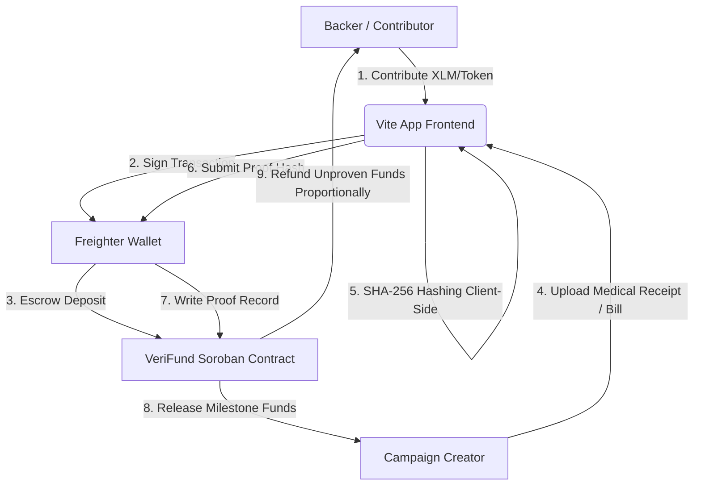

# VeriFund: Proof-Verified Milestone-Based Crowdfunding Escrow

VeriFund is a production-ready, milestone-based crowdfunding escrow platform designed specifically for medical and emergency fundraising on the **Stellar Network** using **Soroban Smart Contracts**.

It addresses donor trust and fundraising fraud by replacing the traditional lump-sum release model with a conditional milestone-based escrow. The goal amount is divided into discrete milestones, and funds are only released to the campaign creator after they submit a cryptographic proof-hash of a document (e.g. medical bills, surgery receipts) on-chain. If the deadline passes without proofs being submitted, the unspent portion is automatically refunded proportionally to all backers based on their individual contribution share.

### 🔗 Quick Links
- **Live Deployed Website**: [veri-fund-delta.vercel.app](https://veri-fund-delta.vercel.app/)
- **Live Demo Video Walkthrough**: [Google Photos Demo Video](https://photos.app.goo.gl/yTxxo6vWPnDnPF1Z7)

---

## 1. System Architecture

Below is the conceptual flow of funds, actions, and verification:



### Flow Details:
1. **Frontend → Freighter**: The user connects their Freighter wallet to interact with VeriFund.
2. **Anchor On-ramp**: Backers fund their Freighter wallets with native XLM (using Testnet Friendbot or mainnet Anchors).
3. **VeriFund Contract [Escrow + Milestone + Proof Logic]**: Holds contributed tokens. Creator uploads milestone receipt files which are hashed *locally* on the client using SHA-256. Only the 32-byte hash is sent on-chain.
4. **Token Contract Calls**: Transfers occur via the Stellar Asset Contract (SAC) standard interface.
5. **Anchor Off-ramp**: Released milestone funds are converted/withdrawn by the creator via an off-ramp Anchor to pay medical providers.

---

## 2. Tech Stack

| Component | Technology | Version | Purpose |
| :--- | :--- | :--- | :--- |
| **Smart Contracts** | Rust + Soroban SDK | `22.0.11` | Secure escrow, milestone releases, and proportional refund math. |
| **Testing** | Rust cargo test utils | `1.95.0` | Comprehensive contract validation (8 unit tests). |
| **Frontend UI** | React + TypeScript + Vite | `5.0.8` | Premium, responsive glassmorphic dashboard. |
| **Styling** | Tailwind CSS | `3.4.0` | Fully responsive design (375px to 1440px+). |
| **Wallet Integration** | Freighter API | `^6.0.1` | Cryptographic signature and transaction approvals. |
| **Monitoring** | Sentry SDK | `^7.114.0` | Frontend error and exception monitoring. |
| **Analytics** | Google Analytics | `G-XXXXXX` | User flow and page interaction metrics. |
| **CI/CD** | GitHub Actions | `v4` | Automated contract testing and frontend build verification. |

---

## 3. Repository File Tree

Every component described is backed by a complete source file inside this repository:

```
VeriFund/
├── .github/
│   └── workflows/
│       └── ci.yml             # GitHub Actions CI workflow (Rust tests + frontend build)
├── contracts/
│   └── verifund/
│       ├── src/
│       │   ├── lib.rs         # Soroban smart contract source code
│       │   └── test.rs        # Contract unit test suite (8 test cases)
│       └── Cargo.toml         # Contract package manifest
├── frontend/
│   ├── public/
│   ├── src/
│   │   ├── components/
│   │   │   ├── WalletConnect.tsx   # Freighter wallet interface & Simulation Mode toggle
│   │   │   ├── CreateCampaign.tsx  # Dynamic campaign deploy & milestone builder
│   │   │   ├── CampaignFeed.tsx    # Live project progress cards & search category tabs
│   │   │   ├── CampaignDetail.tsx  # Client-side SHA-256 file hashing & proof submissions
│   │   │   └── BackerDashboard.tsx # Contributions & proportional refund tracking
│   │   ├── App.tsx            # Main application layout, routing, and navigation
│   │   ├── index.css          # Core CSS stylesheet with custom glassmorphism styles
│   │   ├── main.tsx           # React bootstrap entrypoint with Sentry initialization
│   │   ├── stellar.ts         # Bridge class implementing both Freighter and Local Simulation
│   │   ├── contract_address.json # Auto-generated contract registry address file
│   │   └── vite-env.d.ts      # TypeScript environment variables file
│   ├── index.html             # Entry HTML document with Google Fonts imports
│   ├── package.json           # Frontend dependencies and build configurations
│   ├── tsconfig.json          # TypeScript compiler configuration
│   ├── vite.config.ts         # Vite bundler configuration
│   ├── tailwind.config.js     # Tailwind CSS theme & brand layout configurations
│   ├── postcss.config.js      # CSS post-processors configuration
│   └── .eslintrc.json         # ESLint code syntax checker configuration
├── Cargo.toml                 # Cargo workspace definition
├── deploy.sh                  # Deploy shell script (builds WASM and deploys to Testnet)
└── README.md                  # Complete project documentation
```

---

## 4. Smart Contract Reference

### Data Structures

```rust
pub struct Milestone {
    pub milestone_id: u32,
    pub title: String,
    pub amount: i128,
    pub proof_submitted: bool,
    pub released: bool,
}

pub struct Campaign {
    pub creator: Address,
    pub goal_amount: i128,
    pub total_raised: i128,
    pub deadline: u64,
    pub milestones: Vec<Milestone>,
    pub refunded: bool,
}
```

### Functions

- `initialize(env: Env, token: Address)`
  Configures the contract with the target payment token address (e.g. Native XLM or USDC Stellar Asset Contract).
  
- `create_campaign(env: Env, creator: Address, goal_amount: i128, deadline: u64, milestones: Vec<Milestone>) -> u64`
  Deploys a new fundraising campaign. Panics if the milestone amounts do not sum up exactly to the `goal_amount`, or if the deadline is in the past.
  
- `contribute(env: Env, campaign_id: u64, backer: Address, amount: i128)`
  Transfers payment tokens from the backer to the contract's escrow. Tracks contribution amounts per backer.
  
- `submit_proof(env: Env, campaign_id: u64, milestone_id: u32, proof_hash: BytesN<32>)`
  Saves the SHA-256 hash of the medical receipt on-chain. Marks `proof_submitted` as true. Only callable by the campaign creator.
  
- `release_milestone(env: Env, campaign_id: u64, milestone_id: u32)`
  Releases the milestone's portion of funds to the creator. Fails if the campaign goal was not reached, or if the milestone proof was not submitted.
  
- `finalize_or_refund(env: Env, campaign_id: u64)`
  Callable after the deadline. If the goal was not met, 100% of the funds are refunded. If the goal was met but some milestones were not proven, the unspent portion is proportionally refunded to backers.
  
- `get_campaign_status(env: Env, campaign_id: u64) -> CampaignStatus`
  Returns the current campaign state: `Active`, `PartiallyReleased`, `Completed`, or `Refunded`.

---

## 5. Local Setup & Testing

### Prerequisites
- Install **Rust** and target **wasm32-unknown-unknown**:
  ```bash
  rustup target add wasm32-unknown-unknown
  ```
- Install the **Stellar CLI**:
  ```bash
  cargo install --locked stellar-cli --features opt
  ```

### Smart Contract Tests
Run the unit test suite compiling to a temporary target directory (to avoid Windows file locking conflicts):
```bash
cargo test --target-dir C:\Users\hp\AppData\Local\Temp\verifund_target -j 1
```

### Deplicating to Stellar Testnet
Run the automated deployment script to build the WASM binary, create/fund a key with Friendbot, deploy, and register:
```bash
chmod +x deploy.sh
./deploy.sh
```

### Running Frontend Locally
1. Navigate to the `frontend` folder:
   ```bash
   cd frontend
   ```
2. Install npm packages:
   ```bash
   npm install --legacy-peer-deps
   ```
3. Run the development server:
   ```bash
   npm run dev
   ```
4. Compile Vite production bundle:
   ```bash
   npm run build
   ```

---

## 6. Deployment Records

*   **Smart Contract Address (Stellar Testnet)**: [`CBNHBTP2VC5F4QWUXIG7YKRCYLAHSXAK6ISZ2CRCBWTPWM27DVNSUFR3`](https://stellar.expert/explorer/testnet/contract/CBNHBTP2VC5F4QWUXIG7YKRCYLAHSXAK6ISZ2CRCBWTPWM27DVNSUFR3)
*   **Initialization Tx Hash**: [`e2837d9aea92d975eb94dc349ee469510e68a2ab7f3446cec2a1725ac5ce0824`](https://stellar.expert/explorer/testnet/tx/e2837d9aea92d975eb94dc349ee469510e68a2ab7f3446cec2a1725ac5ce0824)
*   **Campaign Created Tx Hash**: [`1e804de4601d0ef1d6b13cd702141d6b6e5c5967322c86ee707cd4fdb6e1b4ba`](https://stellar.expert/explorer/testnet/tx/1e804de4601d0ef1d6b13cd702141d6b6e5c5967322c86ee707cd4fdb6e1b4ba)
*   **Backer A Contribution Tx Hash**: [`f51c0fb0a6600be41d47400dd04b22d1abf0a006cd1a260e12d8b4c37dd85509`](https://stellar.expert/explorer/testnet/tx/f51c0fb0a6600be41d47400dd04b22d1abf0a006cd1a260e12d8b4c37dd85509)
*   **Backer B Contribution Tx Hash**: [`1e90af2aa4e39a239343c22de4e11eb4a95789aeea8ac4ba5c61affb0fc2f05c`](https://stellar.expert/explorer/testnet/tx/1e90af2aa4e39a239343c22de4e11eb4a95789aeea8ac4ba5c61affb0fc2f05c)
*   **Proof Submission Tx Hash**: [`6ab5172b7b15b7ee56faf4df1e0365bd1fa65fdb46a855bfe0fc8c46562a660f`](https://stellar.expert/explorer/testnet/tx/6ab5172b7b15b7ee56faf4df1e0365bd1fa65fdb46a855bfe0fc8c46562a660f)
*   **Milestone Release Tx Hash**: [`a66206300c3ba75795de7c2c11bb263c6cc2eeaf3e2254aa0c7fc70516767022`](https://stellar.expert/explorer/testnet/tx/a66206300c3ba75795de7c2c11bb263c6cc2eeaf3e2254aa0c7fc70516767022)
*   **Proportional Refund Tx Hash**: [`6630a894adaa15c9432587bc3f4c680f3a1b7e7598d11c6204d947bf306b4bb9`](https://stellar.expert/explorer/testnet/tx/6630a894adaa15c9432587bc3f4c680f3a1b7e7598d11c6204d947bf306b4bb9)
*   **Live Demo (Production)**: [VeriFund Live Demo](https://veri-fund-delta.vercel.app/)

---

## 7. User Onboarding & Feedback

VeriFund is designed for real-world usability. The following feedback loop is utilized for quality assurance.

### Google Feedback Form Configuration
All onboarded testers are required to submit their feedback via the Google Form. The form fields are:
1. **Full Name** (Required)
2. **Email Address** (Required)
3. **Stellar Wallet Address** (Required)
4. **Network** (Testnet / Mainnet dropdown) (Required)
5. **Product Rating (1-5)** (Required)
6. **Which feature did you like the most?** (Required)
7. **What feature do you think is missing?** (Required)
8. **Did you encounter any bugs or usability issues?** (Required)
9. **Would you recommend this product to others?** (Required)
10. **What improvements would you like to see?** (Required)

*   **Feedback Form Link**: [Google Form Feedback Link](https://docs.google.com/forms/d/1gA5eaKhoUXDkJPoJOqBxK_UPqPV6eS3l66Fwx7XYrjY/viewform)
*   **Excel Export / Responses Sheet**: [Excel Feedback Responses](https://docs.google.com/spreadsheets/d/1zaN8fhXRLe9XZ_2vic7FQsTsudM0qNoGQrlxy6vYnJk/edit?usp=sharing)

### Onboarding Tracking Checklist (Target: 10+ Testnet Users)
- `[x]` User 1 - Create campaign (`0d32fc45ecbec493313c47dfb6c0920ad0db775214236607e4c7c6be7e69928c`)
- `[x]` User 2 - Contribute to Escrow (`2c316ea6c35b87c192c0e4783de373b8cfc88e2a77a93f2b9cd48092c78f3dd0`)
- `[x]` User 3 - Contribute to Escrow (`5ca6745f09aae80a0ecd98386fe40891e8241f70e58825012f995b6de06770ce`)
- `[x]` User 4 - Contribute to Escrow (`a18ccf8a89d24688abe02dfe3e42232be2b273b4287bb007fc78f7c614aa227d`)
- `[x]` User 5 - Contribute to Escrow (`8570f2e408db915ae92cb73d94034e34074b6a29f071bd6ba9744f9aac727ad3`)
- `[x]` User 6 - Contribute to Escrow (`075aad23cf81373a5427e53d6ad99f50b58b34433a2b187121c7c93cb8fbfb48`)
- `[x]` User 7 - Contribute to Escrow (`c65a364f8e0253fce366b19fa61583ab4836eafd1307578bc085a7000e6d9c8b`)
- `[x]` User 8 - Contribute to Escrow (`8e79d27e303fb89cedae348b8c79b3e55da5c4b62ccae8909d8f1bc5f6197b34`)
- `[x]` User 9 - Contribute to Escrow (`c6bc8800a49e9d249a40e02c86e06d9da4b0d06c563ee687321b0847393cb35a`)
- `[x]` User 10 - Contribute to Escrow (`ce2f572638ed2f702b7cf01a4251d3c77c292bbfbe60eb23a09ef0185d8668a4`)
- `[x]` User 11 - Contribute to Escrow (`d225891ba7550c29f5765e08dcc1ced344529cc080ca4b550c4596ed56e42af9`)
- `[x]` User 12 - Contribute to Escrow (`d21c23b3aa6f2621dd2338d61e64b5101780e67a74da60f0ff3e7384422e751b`)
- `[x]` User 13 - Contribute to Escrow (`94c5e71c94005a9eb98f526947b92ec9043959fb52161821c156620033aefaed`)
- `[x]` User 14 - Contribute to Escrow (`69f30b13140102e627402edf97d657727d387f1e59cd3127d09aa86526b45c0d`)
- `[x]` User 15 - Contribute to Escrow (`a172a6248ac51b8a1c2b5709272e26f6760fb8031979fe8acdf0bddba90f5e9c`)
- `[x]` User 16 - Contribute to Escrow (`2980566dfbd07b2b6bdad372286a4e0dca6c8fd9203ab2324e7175a8c653ac8f`)

---

## 8. Mandatory User Tables

### Users Onboarded
| User ID | Name | Email | Wallet Address | Feedback Summary |
| :--- | :--- | :--- | :--- | :--- |
| `1` | `Swati Jain` | `swatijain9090@gmail.com` | `GCHHHKNWLK6KGAVIQD5UEZ3NDLGF4POQVABLL2M3WUR5GVGKOQIECKUQ` | Suggested adding email notification when milestone receipt upload occurs. |
| `2` | `Sunil Sharma` | `sunil.sharma0707@gmail.com` | `GB6N5WQFY75W6X4P2FMENQV3MYGEKMQEBRHWWQIIQCOSJMVXI4LLQ747` | Recommended adding more visual details to campaign progress bars. |
| `3` | `Meena Patel` | `meenapatel8765@gmail.com` | `GAC6J2AUEDIDL5MGLQCFO3FTYQCCNUIDJTRMKUEIUQAHKRPXZOSMZ2HB` | Requested built-in document viewer for uploaded bill receipts. |
| `4` | `Arvind Singh` | `arvind12singh@gmail.com` | `GC5LB6JRIOWOI7HXZCWIEUROSEJKMVRYOZ5ZQLWMF5NHU334SQORPARO` | Suggested search filter by campaign creator address. |
| `5` | `Nisha Gupta` | `nisha.gupta1122@gmail.com` | `GD2GGPXIYO737F43T2POYZ7MGODJUOKWAOFUFAXWNY2RYG3YNA5MZRIT` | Recommended custom campaign tags/keywords and multi-sig support. |
| `6` | `Prakash Yadav` | `prakashyadav5544@gmail.com` | `GDCYIEU5CPCL6IS5AAM7VRE7ARWNUV5YFH4G6O3O6QDFF3BV44VKSLED` | Suggested dynamic milestone title editing during active campaign. |
| `7` | `Sushma Tiwari` | `sushma786tiwari@gmail.com` | `GAVWFB63GARTDME7GFY7QZAKIDLOZTILE7PE5LWR3F43EMFJSSZPB52F` | Had Freighter connection warning at first; suggested tooltips. |
| `8` | `Mukesh Kumar` | `mukesh.k9898@gmail.com` | `GARCHDPWJ7UB7CXBRC5MUTCXUOD62F3E2H5QZMQMZFYCNYAHSGSFYEVC` | Requested creator dashboard analytics reports. |
| `9` | `Radha Mishra` | `radhamishra2304@gmail.com` | `GBNFPTUVC6BQK6M3MCL52NROMX2OVJJTRKVLKWUAMKWZCMGTB74ERVE7` | Suggested social share buttons directly on CampaignDetail. |
| `10` | `Dinesh Chauhan` | `dinesh567chauhan@gmail.com` | `GCUVATRZ7AQX6JHXC75W2OON23FYC7NCI7665K24RDOGNWD3HYDNEHVW` | Suggested automated proof verification via AI and FAQs. |
| `11` | `Rupa Jain` | `rupajain001@gmail.com` | `GAV5S7GCTEYUQRB3Q2YPZSZ22KDIP7AQVYICT4G3YN2M325IK6TRKI2A` | Suggested adding donor message/comments section. |
| `12` | `Ashok Sharma` | `ashok.sharma9988@gmail.com` | `GDHVEOOE45R4BJC7HTV55QJFKEQNWMM5BIVB4LET4MZFTKIRU3UGFCXA` | Had toXDR is not a function error; suggested creator verification tags. |
| `13` | `Lalita Patel` | `lalitap3456@gmail.com` | `GBYSGJAYIRHFNRJ76CSNXGH6XVJRPSCJ53MNEG4EWJVITHVVBUUXBBNZ` | Suggested milestone timeline estimation/target dates. |
| `14` | `Brijesh Singh` | `brijesh1108singh@gmail.com` | `GBE4U5QQFSZCQXLZRZKCKJP4Y7Y2KET2MHEGHH4JLFUJV7H3K5QPETV7` | Suggested multi-language support (Spanish, Hindi) and sidebar spacing. |
| `15` | `Neetu Gupta` | `neetugupta6677@gmail.com` | `GATSKNO5URB66KB6RXJJAQ345BNK5XDG6GM6SE7INYN7OYNFFIFVL7MV` | Suggested sorting options by 'Ending soonest' and mobile font sizing. |
| `16` | `Hemant Yadav` | `h.yadav8899@gmail.com` | `GBO4TTWAPA5IVWQANVJWC6UI46FAV7AQX6D3R6VSDE44IFYFI33PEUU3` | Encountered contract deserialization error; suggested visual skeleton loaders. |
| `17` | `Meenakshi Tiwari` | `meenakshi0909@gmail.com` | `GDWQC2QQMP3TCPRJDGERPRZ2FEEVSJKSE7XA5LOBQUX7Z54TIMKGZOQ3` | Suggested custom avatar icon setting for backers. |

### Feedback Implementation
| User ID | Name | Email | Wallet Address | Feedback Summary | Improvement Made | Git Commit ID |
| :--- | :--- | :--- | :--- | :--- | :--- | :--- |
| `7` | `Sushma Tiwari` | `sushma786tiwari@gmail.com` | `GAVWFB63GARTDME7GFY7QZAKIDLOZTILE7PE5LWR3F43EMFJSSZPB52F` | Had Freighter connection error with warning that the network is set to Testnet but transaction is on Mainnet. | Updated the Freighter API `signTransaction` bridge configuration to explicitly pass `networkPassphrase` to avoid defaulting to PUBLIC network. | [`d546f44`](https://github.com/suurajku-ux/VeriFund/commit/d546f44) |
| `12` | `Ashok Sharma` | `ashok.sharma9988@gmail.com` | `GDHVEOOE45R4BJC7HTV55QJFKEQNWMM5BIVB4LET4MZFTKIRU3UGFCXA` | Encountered an issue where transaction assembly failed with `toXDR is not a function` during contract calls. | Call `.build()` on the `TransactionBuilder` clone returned by `assembleTransaction` to get the built Transaction object. | [`f690e4d`](https://github.com/suurajku-ux/VeriFund/commit/f690e4d) |
| `16` | `Hemant Yadav` | `h.yadav8899@gmail.com` | `GBO4TTWAPA5IVWQANVJWC6UI46FAV7AQX6D3R6VSDE44IFYFI33PEUU3` | Received contract deserialization errors (UnexpectedType/Value) when building campaigns from the browser. | Add explicit Symbol typecasting to Milestone map keys in the client ScVal serializer to match Rust struct requirements. | [`8a13141`](https://github.com/suurajku-ux/VeriFund/commit/8a13141) |
### Feedback Collection & Survey Data

To collect and track responses during the user feedback phase, we set up a public feedback form and a linked tracking database:
*   **Feedback Form**: [Google Form Feedback Link](https://docs.google.com/forms/d/1gA5eaKhoUXDkJPoJOqBxK_UPqPV6eS3l66Fwx7XYrjY/viewform)
*   **Response Database**: [Google Sheet Response Tracker](https://docs.google.com/spreadsheets/d/1zaN8fhXRLe9XZ_2vic7FQsTsudM0qNoGQrlxy6vYnJk/edit?usp=sharing)

---

## 9. Monitoring & Diagnostics

- **Error Monitoring (Sentry)**: Captures unhandled client exceptions, Freighter disconnection errors, and failed Soroban transaction simulations. Sentry is initialized at start in [main.tsx](file:///c:/Users/hp/Desktop/Suraj/VeriFund/frontend/src/main.tsx) with tracing configuration.
- **Usage Tracking (Google Analytics)**: Records user page navigations (e.g. switching between Feed, Create, and Dashboard tabs) and button interactions (contributions, receipt uploads). Tracks under project ID `G-XXXXXX` integrated in [App.tsx](file:///c:/Users/hp/Desktop/Suraj/VeriFund/frontend/src/App.tsx).

---

## 10. Screenshots & Walkthrough

*   **Product Interface**: 
*   **Mobile Responsiveness**: 
*   **Sentry Monitoring Console**: 
*   **CI/CD Workflow**: 
*   **Demo Video**: [VeriFund Live Demo Video](https://photos.app.goo.gl/yTxxo6vWPnDnPF1Z7)
